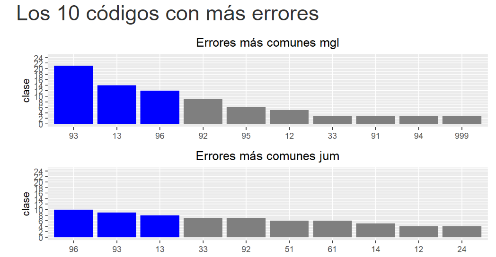
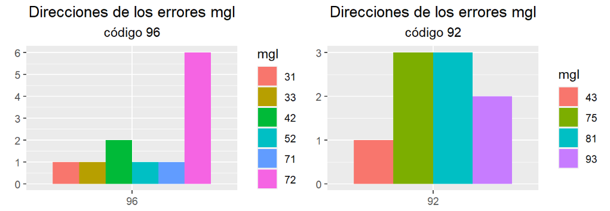
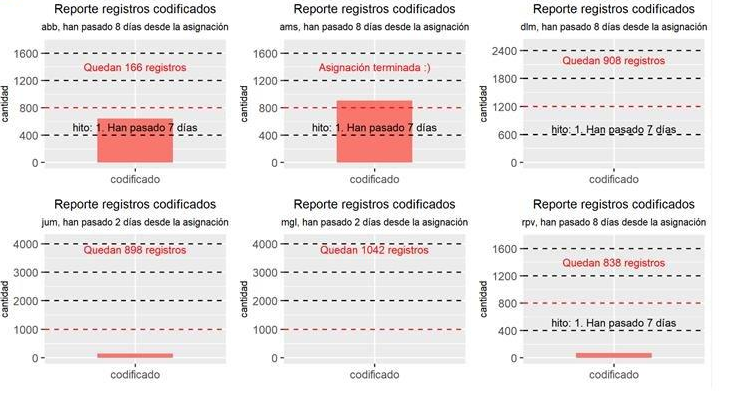
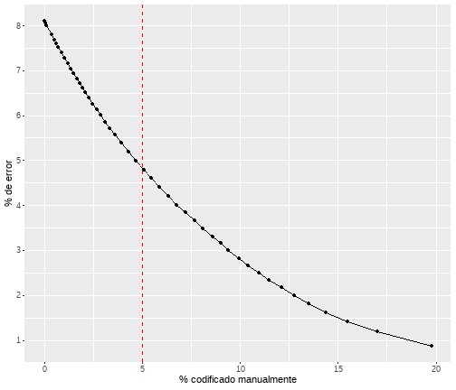

<style>
body {
text-align: justify
}
</style>


```{r setup, include=FALSE}
knitr::opts_chunk$set(echo = F, warning = F, message = F, fig.align="center")
```


# Presentación

Tradicionalmente, los procesamientos estadísticos en el INE han recurrido a una estrategia de codificación manual para las variables de respuesta abierta. De este modo, personas entrenadas en el uso de clasificadores leen cada uno de los registros y asignan el código más adecuado, sobre la base de criterios predefinidos. Este procedimiento, por ser intensivo en trabajo manual, requiere una gran cantidad de tiempo y presenta algunas limitaciones para lograr una completa uniformidad en la utilización de criterios. 

Con el objeto de hacer más eficiente el uso de recursos y mejorar la calidad de los datos, durante los últimos años la institución ha avanzado en estrategias automatizadas de codificación, basadas en técnicas de aprendizaje de máquinas (*machine learning*). El conocimiento acumulado y el desarrollo de competencias han permitido que estas técnicas sean aplicadas en la Encuesta Nacional de Empleo (ENE), en ENUSC 2019 y en la última Prueba Piloto EPF (realizada en 2020). En el caso de la ENE, desde marzo de 2019 se está implementando una metodología similar a la desarrollada por Guerrero y Cabezas [@guerrero_cabezas], quienes muestran resultados para CAENES y CIUO-88.CL[^codificacion]. La posterior adaptación e implementación de dicha metodología se encuentra descrita en el documento "Sistema de clasificación y codificación automática en la Encuesta Nacional de Empleo" [@codificacion_ene]. En el caso de la Prueba Piloto EPF, se utilizaron modelos de *deep learning* para codificar los datos de gasto en base al clasificador CCIF. Por su parte, en ENUSC 2019 se automatizó la codificación de CIUO-08.CL, también mediante una estrategia basada en *machine learning*.

[^codificacion]: CAENES corresponde al acrónimo de Clasificador de Actividades Económicas Nacional para Encuestas Sociodemográficas. Este clasificador es una adaptación del clasificador internacional CIIU creado para facilitar la medición de actividad económica en el contexto de encuestas de hogares. CAENES es utilizado en el INE desde 2016 y su metodología se describe extensamente en el documento Clasificador de Actividades Económicas Nacional para Encuestas Sociodemográficas. Por su parte, CIUO-88 corresponde al acrónimo de Clasificador Internacional Uniforme de Ocupaciones. En el caso del documento citado de Guerrero y Cabezas (2019), se utilizan datos codificados con la versión 88 del clasificador. Actualmente, el INE realiza sus levantamientos con la versión 08. Ambos documentos se encuentran disponibles en: [CAENES](https://www.ine.cl/docs/default-source/ocupacion-y-desocupacion/metodologia/espanol/documento-clasificador-de-rama-de-actividad-econ%C3%B3mica-caenes-(abril-2016).pdf?sfvrsn=1b1cc016_3#:~:text=El%20CAENES%20es%20una%20clasificaci%C3%B3n,4) y [CIUO](https://www.ine.cl/docs/default-source/buenas-practicas/clasificaciones/ciuo/clasificador/ciuo-08-cl.pdf?sfvrsn=7a72e6af_4)

Sin duda, la utilización de este tipo de herramientas supone un avance en la elaboración de estadísticas, ya que ello permite disminuir tiempos de procesamiento y mejorar la calidad de los productos, sin embargo, los métodos de clasificación basados en *machine learning* presentan algunas limitaciones que no deben perderse de vista. Una de las más importantes guarda relación con la posible desactualización de los datos que se utilizan para el entrenamiento de los modelos. 

Cuando los datos de entrenamiento comienzan a perder representatividad o, dicho de otro modo, cuando las características del conjunto de entrenamiento empiezan a diferir de manera importante de las características de los datos para los cuales se busca hacer una predicción, lo más probable es que el rendimiento real sea más bajo que el estimado durante el proceso de entrenamiento. En la medida en que los nuevos datos se van distanciando del conjunto inicial, lo esperable es que las predicciones se vayan deteriorando progresivamente, afectando de manera importante la calidad estadística de los productos que usen esta estrategia.  

La desactualización puede provenir de varias fuentes. Una de las más importantes se relaciona con cambios metodológicos, tales como el tránsito de encuestas en papel a dispositivos electrónicos, modificaciones en los cuestionarios, incorporación de nuevas instrucciones en los operativos de campo, entre otras. Una segunda fuente de desactualización es el dinamismo propio de los fenómenos que las encuestas de hogares miden. A modo de ejemplo, tanto la ocupación como el consumo de los hogares constituyen fenómenos que van cambiando en el tiempo. Así, al alero de cambios tecnológicos, van surgiendo nuevas ocupaciones, a la vez que otras desaparecen. En el caso del consumo de los hogares ocurre algo similar, ya que el mercado constantemente va cambiando la oferta de bienes y servicios, al mismo tiempo que se modifican las preferencias de los hogares.

Todos estos cambios añaden dificultades a las estrategias de codificación basadas en *machine learning* e imponen la necesidad de monitorear constantemente los modelos que están en producción, con el objeto de introducir ajustes, en caso de que ello sea necesario. En ese sentido, el presente proyecto tiene como objetivo principal construir bases de entrenamiento actualizadas y optimizar algoritmos de codificación automatizada para los clasificadores CAENES y CIUO-08.CL. Dado que la institución se encuentra en un proceso de migración hacia dispositivos electrónicos de captura, es deseable contar con datos de entrenamiento que provengan de levantamientos con dispositivos de este tipo. El motivo de ello es que la manera en la que se registra la información en un dispositivo electrónico difiere del modo en que las personas lo hacen en un formato basado en papel, en términos de cantidad y tipo de palabras utilizadas. Es así que el presente proyecto pone a disposición dos sets de datos (CAENES y CIUO-08.CL) provenientes de levantamientos CAPI (*Computer assisted personal interview*).  En la elaboración de estos sets de entrenamiento, se ha intentado utilizar altos estándares de exigencia, con el objeto de ofrecer datos con una alta calidad, que permitan llevar a cabo próximos entrenamientos.  

Como objetivo secundario, este proyecto intenta subsanar la aún escasa diseminación en lo que respecta al desarrollo y uso de técnicas basadas en *machine learning* dentro de la institución. Si bien se han llevado a cabo avances importantes en esta materia, aún existe una brecha de competencias que es posible estrechar. Para ello, se disponibilizan las rutinas utilizadas y al mismo tiempo se pone en funcionamiento una herramienta que permite utilizar los modelos entrenados de manera relativamente sencilla. Con esto último se busca que los esfuerzos realizados por este equipo puedan ser de utilidad para operaciones que tengan necesidades similares de codificación, contribuyendo a un uso más eficiente de los recursos públicos.      

El presente documento tiene como objetivo documentar el proceso de creación de bases de datos de entrenamiento para CAENES y CIUO-08.CL, así como describir los principales procedimientos realizados durante la fase de entrenamiento de los modelos. Con esto se busca poner a disposición un material de apoyo, para quienes utilicen los datos y/o modelos generados en el marco de este proyecto.


# Agradecimientos
Este proyecto, en particular en su fase de creación de datasets de entrenamiento para los clasificadores CAENES y CIUO-08.CL, se benefició de la valiosa colaboración de diferentes equipos del Instituto Nacional de Estadísticas. El Proyecto Estratégico Servicios Compartidos para la Producción Estadística agradece al Subdepartamento de Estadísticas Continuas del Trabajo y al Subdepartamento de Estadísticas Socioeconómicas por la provisión de glosas desde sus operaciones estadísticas para construcción de los datasets de entrenamiento, y al Departamento de Estadísticas Demográficas y Sociales, al Departamento de Estadísticas Económicas, al Departamento de Estadísticas de Trabajo y al Departamento de Operaciones de Estadísticas Económicas y Precios, por el apoyo de sus profesionales en el etiquetado manual de glosas de ocupación y actividad económica.

Se destaca especialmente el trabajo de Antonieta Maulén, analista del Departamento de Operaciones de Estadísticas Sociales, por su dedicación y soporte constante al proyecto, así como también a la Sección de Nomenclaturas, del Subdepartamento de Calidad y Estándares, quienes velaron por la calidad de la codificación de los datasets de entrenamiento, a partir de auditorías y retroalimentación constante.


# *Machine learning* para la codificación de CAENES y CIUO-08.CL

## Codificación automatizada de textos

Las encuestas de hogares suelen contener preguntas abiertas en formato de texto libre. Esta información puede tener relación con el mercado del trabajo, el consumo de los hogares, la victimización, entre otros. Para que dicha información sea utilizada con fines estadísticos se debe recurrir a algún sistema de codificación estandarizado, de manera tal de que cada texto sea asociado a un código dentro de un sistema de clasificación. Históricamente, este trabajo ha sido realizado por codificadores entrenados para esta tarea. Así, personas que conocen en detalle los clasificadores leen cada uno de los textos y asignan un código conforme a criterios pre establecidos. Esta estrategia, por tanto, es intensiva en trabajo manual.

Es posible identificar, al menos, 2 debilidades de una estrategia basada en codificación manual:

- Requiere una gran cantidad de tiempo, ya que es necesario que cada uno de los textos sea leído y luego codificado por una persona. Típicamente, una muestra tiene varios miles de registros, lo que implica que el trabajo manual destinado a esta tarea sea significativo, generando tiempos de espera y costos en horas persona. 

- El hecho de que la asignación de códigos descanse en las decisiones de distintas personas, hace bastante complejo el aseguramiento de una completa uniformidad en la aplicación de criterios. Si bien cada clasificador cuenta con un marco conceptual definido, la aplicación de criterios en la práctica no siempre resulta una tarea sencilla. La información levantada en terreno muchas veces puede ser insuficiente o ambigua, lo cual hace que se torne difícil la utilización de criterios rígidos.   

A raíz de las dos situaciones mencionadas, es que se torna deseable la utilización de estrategias automáticas de codificación. Un proceso automático aplicado a la codificación permite disminuir significativamente las horas empleadas para dicha tarea y, al mismo tiempo, elimina el espacio para la discrecionalidad al momento de asignar un código. 

En lo que respecta a la automatización de la codificación en producción de estadísticas oficiales, es posible identificar dos enfoques principales: codificación basada en reglas y codificación basada en métodos de aprendizaje de máquinas (*machine learning*). En el primero de estos enfoques, el o la analista genera reglas *a priori*, mediante las cuales un programa o rutina asigna un código. La mayor fortaleza de este enfoque radica en que no es necesario contar con datos históricos, pues solo se requiere que el o la analista identifique las reglas y las programe en una rutina. Una vez realizada la tarea de identificación de reglas, los datos pasan a través del programa y el código es asignado. La desventaja más importante y evidente es que se hace necesario que alguien escriba las reglas, lo cual constituye una tarea ardua, ya que por lo general el número de condiciones que se deben escribir no es despreciable. De hecho, es muy poco probable que se llegue a codificar el 100% de los registros mediante esta estrategia.     

El segundo enfoque está basado en el aprendizaje que un algoritmo puede obtener de los datos que se han etiquetado en el pasado. A diferencia de la estrategia anterior el o la analista no crea las reglas, sino que estas son aprendidas por un algoritmo, el cual, después de un proceso de entrenamiento, es capaz de codificar registros nuevos gracias al aprendizaje previo. Naturalmente, esta estrategia supone la existencia de datos codificados con anterioridad, lo cual no siempre ocurre o no ocurre de manera óptima. Por ejemplo, es posible que la cantidad de datos codificados sea muy pequeña, que estos no sean representativos del fenómeno en cuestión o que, simplemente, la calidad del etiquetado no sea la más adecuada. En cada uno de estos casos se ve afectada la posibilidad de que un algoritmo "aprenda" correctamente. Ahora bien, cuando la fuente de datos de entrenamiento sí cumple ciertos requisitos de calidad, se puede llevar a cabo un proceso de aprendizaje, mediante el cual es posible codificar registros nuevos en poco tiempo y a un costo muy bajo.          

Dependiendo del contexto y de los datos históricos con los que se cuente, un equipo debería privilegiar una estrategia u otra. A priori, no es tan sencillo determinar qué estrategia es la más eficiente, ya que existen consideraciones de costos que deben ser sopesadas en el marco de cada proceso productivo. Para operaciones estadísticas coyunturales, cuya metodología no experimenta cambios importantes, puede ser de gran utilidad un enfoque basado en *machine learning*, ya que un mismo entrenamiento puede ser utilizado para muchos levantamientos.  Por otro lado, operaciones estadísticas de naturaleza estructural, posiblemente, no se vean demasiado benefiadas por una estrategia de *machine learning*, ya que en periodos extensos de tiempo es muy problable que los clasificadores experimenten cambios relevantes, lo cual dejaría en obsolecencia los datos de entrenamiento.  

El INE cuenta con experiencia institucional en el uso de ambos enfoques sin embargo, en lo que respecta al presente documento, se ahondará solamente en la estrategia de *machine learning*. 

## Limitaciones de un método de *machine learning* 

Una codificación automática basada en *machine learning* tiene una serie de ventajas, sin embargo, también presenta algunas limitaciones que es preciso tener en consideración al momento de poner en producción esta estrategia. El supuesto más importante en una estrategia basada en *machine learning* es que los datos de entrenamiento son representativos de los datos nuevos que se pretende codificar. Si dicho supuesto no se cumple, la estimación del error de predicción estará sesgada y, muy probablemente, el error real sea mayor al estimado. En ese sentido, nunca debe perderse de vista la relación que existe entre los datos de entrenamiento y aquellos para los que se está haciendo una predicción. En el contexto de las estadísticas oficiales, este problema podría originarse por varias causas. Algunas de las más importantes son:

- El dinamismo de los fenómenos en cuestión: la ocupación, el consumo o la producción son fenómenos que van cambiando constantemente. En el caso del mercado del trabajo, es posible que surjan nuevas ocupaciones que no estén consideradas dentro del conjunto de datos de entrenamiento. Un ejemplo de ello son las ocupaciones que surgen al alero de cambios técnológicos. En el caso del consumo de los hogares ocurre algo similar, ya que constantemente nuevos bienes y servicios son lanzados al mercado, lo que introduce presión sobre el proceso de codificación automática.


- Cambios metodológicos durante el levantamiento: podría ocurrir que el modo en el que se capturan los datos introduzca que sus características cambien. Algunos ejemplos de ello son: cambios en las baterias de preguntas utilizadas o en su fraseo, migración de papel a dispositivos electrónicos, cambio en las instrucciones por parte de los equipos de terreno, entre otras. Todas estas situaciones podrían generar un cambio en el modo en el que se registra la información, haciendo que los nuevos datos se distancien de aquellos utilizados en el entrenamiento.     

Si comienza a generarse una distancia considerable entre los datos de entrenamiento y aquellos para los que se pretende hacer una predicción, es posible que el rendimiento estimado inicialmente vaya disminuyendo progresivamente. Es deseable, entonces, contar con herramientas que permitan identificar cuándo la predicción del modelo comienza a disminuir. Ahora bien, la identificación de dicho punto no es trivial. La manera más sencilla, pero al mismo tiempo más costosa, es la revisión periódica de las predicciones del modelo por parte de un o una analista altamente entrenado en el sistema de clasificación. Con ello se busca comparar la predicción del modelo con algo que en el contexto de *machine learning* se suele llamar *ground truth*, es decir, con una codificación considerada correcta. En este caso, se asume que los códigos asignados por una persona experta son la *ground truth*. Si una estrategia como esta se realiza con la periodicidad adecuada, es posible identificar el momento en el cual la precisión del modelo comienza a disminuir. La limitación más importante es que se requiere contar con recursos humanos altamente especializados para esta tarea.

Una segunda alternativa sería implementar un sistema automatizado que genere una métrica que compare las características de los datos de entrenamiento con aquellos para los que se requiere una predicción. Esta métrica opera como un *proxy* de precisión, lo cual permite moniteorear el rendimiento del modelo por medio de una variable que no es la preción, pero que sí se relaciona con ella.     

Independientemente de la estrategia para hacer el seguimiento del modelo, la acción esperada es una revisión del proceso de entrenamiento. En ciertas ocasiones el problema podría solucionarse con ciertos ajustes en el procedimiento, pero si el problema se explica por un cambio importante en los datos nuevos respecto a los de entrenamiento, es decir, por una pérdida de representatividad de estos últimos, la alternativa más adecuada es la adición de un conjunto nuevo de datos etiquetados manualmente. 

# Generación de los conjuntos de datos de entrenamiento

## Principales fuentes de información y codificación

Dado que uno de los objetivos del proyecto era generar conjuntos de datos etiquetados provenientes de encuestas realizadas mediante CAPI, las principales fuentes de información corresponden a dicha modalidad. Dos son las fuentes de información más importantes: 1) coyuntura ENE entre los meses de junio y noviembre de 2020, provenientes del sistema informático SIENE, que es el que aloja los datos de encuestas realizadas mediante dispositivo móvil de captura y 2) encuesta Piloto EPF 2020. Una tercera fuente de información muy marginal corresponde a la coyuntura ENE del año 2018, pero solo para algunas categorías de CAENES, escasamente representadas en la base de datos construida inicialmente.

Respecto al origen de la codificación, la mayor parte de esta fue realizada por un equipo de codificadores y codificadoras que apoyaron las actividades del Proyecto Estratégico de Servicios Compartidos. Dicho equipo etiquetó datos provenientes de la coyuntura ENE entre los meses de junio y noviembre de 2020. Una segunda fuente de etiquetado corresponde al control de calidad realizado por el Departamento de Estudios del Trabajo (DET) en el marco de la coyuntura de la Encuesta de Empleo. Debido a que estos datos ya habían sido revisados por una analista experta, pasaron directamente a formar parte del dataset de entrenamiento. 


## Proceso de etiquetado manual

### Codificación cruzada

Con el objeto de alcanzar una codificación de alta calidad se implementó un sistema de doble etiquetado. Así, al principio del proceso cerca de un 90% de los datos fue codificado por dos analistas diferentes, con el fin de conseguir una mayor seguridad respecto al código asignado para cada glosa. Cuando se producía una diferencia en el código asignado, un tercer analista más calificado, discernía cuál era el código final. Es importante mencionar que el porcentaje de doble codificación fue disminuyendo cuando se detectó que la cantidad de registros con discrepancias comenzó a decaer. La decisión de diminuir el porcentaje de doble codificación obedece a motivos de costos, ya que para cumplir con los objetivos del proyecto, se hizo necesario aumentar la velocidad de codificación.    

Es relevante señalar que durante todo el proceso de codificación se contó con el apoyo de la Sección de Nomenclaturas, dependiente del Subdepartamento de Calidad y Estándares, el cual revisaba una muestra mensual de aproximadamente 150 registros para cada clasificador. A partir de dicha revisión, se retroalimentaba al equipo de codificación, tanto en CAENES como en CIUO-08.CL. Esto permitió rectificar ciertos criterios y revisar algunos registros que habían sido codificados sobre la base de reglas mal implementadas. Adicionalmente, la auditoría se utilizó para mejorar la calidad de la codificación, ya que para todos los casos que fueron seleccionados para auditar, el código asignado por el equipo del proyecto estratégico fue reemplazado por el asignado por la Sección de Nomenclaturas. 

Los siguientes gráficos muestran el rendimiento de los y las analistas durante el periodo de codificación. En el caso de CIUO-08.CL, se advierte una mejora importante en un breve periodo de tiempo. Por otro lado, en CAENES la precisión se mantiene relativamente estable y la caída que se observa durante el tercer mes es atribuible a un efecto de la muestra escogida, pues al ser esta de solo 150 casos, es esperable encontrar variaciones de este nivel entre muestras, lo cual lleva a desestimar una caída real en el rendimiento en el mes en cuestión. De hecho, en la auditoría final, como se mostrará en el siguiente apartado, se registra una precisión de 92,5% aproximadamente en la codificación de CAENES.

Una de las razones más importantes que explican las trayectorias disímiles de ambos clasificadores se relaciona con la experiencia de las personas que trabajaron en cada uno de los clasificadores. En el caso de CAENES participaron analistas que contaban con experiencia realizando esta tarea, de modo que el espacio de mejora era mucho más limitado que en el caso de CIUO-08.CL, cuyos codificadores y codificadoras no contaban con experiencia previa ni conocían el clasificador, lo que implicaba un espacio de mejora más amplio[^capacitacion_inicial] .    

[^capacitacion_inicial]: Todas las personas que colaboraron en la codificación de los datasets de entrenamiento participaron de una capacitación inicial implementada por la Sección de Nomenclaturas. La experiencia previa en codificación, si bien era deseable, no fue un atributo exigible, dada la dificultad de conseguir apoyos con dicha especialización.

```{r cargar_paquetes}
library(feather)
library(tidyverse)
library(kableExtra)
library(readxl)
library(patchwork)

```


```{r auditorias_parciales, fig.align="center", fig.height=4.2, fig.width=8}

# Pie de página para todas las tablas
footnote <- "Fuente: elaboración propia, Instituto Nacional de Estadísticas "


caenes_files <-  list.files("src/data/auditoria", pattern = "auditoria_.*_caenes_final", full.names = T)
ciuo_files <-  list.files("src/data/auditoria", pattern = "auditoria_.*_ciuo_final", full.names = T)


# CAENES
auditorias_caenes <- map(caenes_files, ~read_excel(.x)) %>% 
  map(~.x %>% mutate_at(vars(codigo_c5, codigo_c9, codigo_d5), as.character)) %>% 
  bind_rows() %>% 
  mutate(estado_conformidad = estado_conformidad_c5,
         estado_conformidad = if_else(!is.na(estado_conformidad_c9), estado_conformidad_c9, estado_conformidad ),
         estado_conformidad = if_else(!is.na(estado_conformidad_d5), estado_conformidad_d5, estado_conformidad ),
         estado_conformidad = str_trim(tolower(estado_conformidad), side = "both"),
         estado_conformidad = str_replace(estado_conformidad, pattern = "  ", " ")) %>% 
    mutate(conforme = if_else(estado_conformidad == "conforme" | 
                              estado_conformidad == "conforme con observaciones" , 1, 0)) %>% 
  group_by(mes) %>% 
  summarise(frecuencia = sum(conforme),
              porcentaje = round(sum(conforme) / n() * 100, 1)) %>% 
  mutate(origen = "total") %>% 
  mutate(mes = case_when(
    mes == 6 ~ "junio", 
    mes == 7 ~ "julio",
    mes == 8 ~ "agosto"
  )) %>% 
  mutate(mes = fct_relevel(mes, "junio", "julio", "agosto")) %>% 
  arrange(mes)


# CIUO
names(ciuo_files) <- map(ciuo_files, ~str_extract(.x, pattern = "auditoria_.*_ciuo_final"))
auditorias_ciuo <- map(ciuo_files, ~read_excel(.x)) %>% 
  map(~.x %>% mutate_at(vars(codigo), as.character)) %>% 
  imap(~.x %>% mutate(mes = .y )  )  %>% 
  bind_rows() %>%
  mutate(mes = str_extract(mes, "junio|julio|agosto")) %>% 
  mutate(estado_conformidad = str_trim(tolower(estado_conformidad), side = "both"),
          estado_conformidad = str_replace(estado_conformidad, pattern = "  ", " ")) %>% 
    mutate(conforme = if_else(estado_conformidad == "conforme" | 
                              estado_conformidad == "conforme con observaciones" , 1, 0)) %>% 
  group_by(mes) %>% 
  summarise(frecuencia = sum(conforme),
              porcentaje = round(sum(conforme) / n() * 100, 1)) %>% 
  mutate(origen = "total") %>% 
  mutate(mes = fct_relevel(mes, "junio", "julio", "agosto")) %>% 
  arrange(mes)


plot1 <- auditorias_ciuo %>%
  ggplot(aes(mes, porcentaje,  group=1 )) +
  geom_point() +
  geom_line() +
  geom_text(aes(label = round(porcentaje, 1)),
            vjust = -1, hjust = 1,
            show.legend = FALSE) +
  scale_y_continuous(limits = c(68, 92)) +
  labs(title = "Gráfico 1: Auditorías parciales de CIUO",
       subtitle = "Cada muestra contiene 150 glosas",
       caption = footnote
       ) + 
  theme(plot.title = element_text(hjust = 0.5),
        plot.subtitle = element_text(hjust = 0.5),
        plot.caption = element_text(hjust = 0)
        )

plot2 <- auditorias_caenes %>%
  ggplot(aes(mes, porcentaje,  group=1 )) +
  scale_y_continuous(limits = c(68, 92)) +
  geom_point() +
  geom_line() +
  geom_text(aes(label = round(porcentaje, 1)),
            vjust = 1.5, hjust = 1,
            show.legend = FALSE) +
  labs(title = "Gráfico 2: Auditorías parciales de CAENES",
        subtitle = "Cada muestra contiene 150 glosas",
       caption = footnote
       ) +
  theme(plot.title = element_text(hjust = 0.5),
        plot.subtitle = element_text(hjust = 0.5),
        plot.caption = element_text(hjust = 0)
        )


# Imprimir 
plot1 + plot2


```


Las siguientes figuras muestran fragmentos del tablero utilizado para retroalimentar al equipo de codificación, sobre la base de la información proporcionada por la auditoría de la sección de Nomenclaturas. Mediante esta herramienta se informaba cuáles eran los códigos que tenían mayor número de errores y cuál era la dirección de dichos errores. El tablero contenía información personalizada para cada miembro del equipo, lo que permitía hacer una retroalimentacion a un nivel muy desagregado, a fin de implementar los ajustes necesarios. Los dos gráficos de más abajo fueron la herramienta más utilizada durante este proceso, pues permitían conocer cuáles eran los códigos que generaban mayor confusión. A modo de ejemplo, el gráfico de abajo a la derecha da cuenta de que el código 92 se estaba confundiendo con los códigos 43, 75, 81 y 93. Esta información fue de gran ayuda para identificar desviaciones en los criterios del clasificador, ya que muchas veces existen sutilezas difíciles de incorporar, que determinan la pertenencia de una glosa a uno u otro subgrupo principal.     


<center>
**Captura 1: Dashborad de retroalimentación para equipo codificación**
{#id .class width=600}




</center>


Debido a que el equipo de codificación estaba conformado por personas con disponibilidades de tiempo muy variadas, era importante contar con algún sistema de seguimiento que permitiera conocer el nivel de avance del proyecto semana a semana. Para ello, se implementó un tablero que permitía monitorear la cantidad de registros codificados por cada persona, así como su nivel de cumplimiento, según la productividad esperada. Las visualizaciones permitían identificar en tiempo real el momento en el que comenzaban a producirse atrasos, lo cual permitía llevar a cabo reasignaciones de carga, en caso de que ello fuera necesario. Este tablero se actualizaba de manera automática una vez por día y estaba disponible para cada uno de los y las integrantes del equipo. Las líneas horizontales representaban semanas de trabajo y cambiaban de color, a fin de mostrar la cantidad de tiempo transcurrido desde la entrega de la asignación. 
     


<center>

**Captura 2: Dashboard para el seguimiento del avance de codificación**

</center>


### Revisión de códigos complejos


Sobre la base de la información recolectada de la codificación cruzada y de las auditorías, se tomó la decisión de llevar a cabo una revisión masiva de algunos códigos más complejos. Para el caso de CIUO-08.CL, la unidad de Nomenclaturas revisó 2.000 registros. 

En el caso de CAENES se realizaron dos revisiones. En primer lugar, 15.318 registros pertenecientes a códigos complejos. En segundo lugar, se revisaron 5.904 registros que cumplían con la característica de tener glosas idénticas, pero con códigos diferentes. Lo anterior requiere un comentario, pues el hecho de que dos glosas idénticas tengan códigos diferentes no necesariamente constituye un error. De acuerdo a la metodología institucional, la primera fuente de información para codificar debe ser la glosa, sin embargo, existen casos en los que la información contenida en ella no permite asignar un código con precisión, a raíz de lo cual se recurre a variables auxiliares. Esto quiere decir que dos glosas idénticas podrían llegar a tener códigos diferentes, si la información de las variables auxiliares así lo sugiere. De hecho, una parte importante de los registros revisados por esta situación no tuvo modificación.   

### Auditorías finales

```{r cargar datos}


caenes <- read_feather("src/data/train_datasets/auditado_ene_long.feather")
ciuo <- read_feather("src/data/train_datasets/auditado_ciuo.feather")

```


```{r auditoria_final}


audi_final_ciuo <- read_excel("src/data/auditoria/auditoria_final_ciuo_nomenclaturas.xlsx")
audi_final_caenes <- read_excel("src/data/auditoria/auditoria_final_caenes_nomenclaturas.xlsx")


create_audi_result <- function(data, variable) {
  
   
  resultado_audi_ciuo_total <- data %>% 
    mutate({{variable}} := tolower({{variable}}),
           {{variable}} := str_trim({{variable}}, side = "both"),
           {{variable}} := str_replace({{variable}}, pattern = "  ", " ")) %>% 
    mutate(conforme = if_else({{variable}} == "conforme" | 
                                {{variable}} == "conforme con observaciones", 1, 0)) %>% 
    summarise(frecuencia = sum(conforme),
              porcentaje = round(sum(conforme) / n() * 100, 1)) %>% 
    mutate(origen = "total")
  
  resultado_audi_ciuo <- data %>% 
    mutate({{variable}} := tolower({{variable}}),
           {{variable}} := str_trim({{variable}}, side = "both"),
           {{variable}} := str_replace({{variable}}, pattern = "  ", " ")) %>% 
    mutate(conforme = if_else({{variable}} == "conforme" | 
                                {{variable}} == "conforme con observaciones", 1, 0)) %>% 
    group_by(origen, conforme) %>% 
    summarise(contar = n()) %>% 
    group_by(origen) %>% 
    mutate(porcentaje = round(contar / sum(contar) * 100, 1)) %>% 
    filter(conforme == 1) %>% 
    select(origen, frecuencia = contar, porcentaje) %>% 
    bind_rows(resultado_audi_ciuo_total) %>% 
    mutate(frecuencia = format(frecuencia, big.mark = "."),
           porcentaje = format(porcentaje, decimal.mark = ","))

  return(resultado_audi_ciuo)
  
}

resultado_final_ciuo <- create_audi_result(audi_final_ciuo, codigo_conformidad)
resultado_final_caenes <- create_audi_result(audi_final_caenes, estado_conformidad_final)


```


Una vez finalizada la revisión de glosas complejas, se llevó a cabo una auditoría que contempló 3.000 registros: 1.500 de CAENES y 1.500 de CIUO-08.CL. El resultado de esta auditoría final muestra que los datos codificados por el equipo de Servicios Compartidos (SSCC) tienen una coincidencia de 91,1% respecto a lo señalado por la Sección de Nomenclaturas en el caso de CIUO y 92,5%, en el caso de CAENES. Respecto a los registros provenientes del control de calidad de la ENE, el porcentaje de acierto es un poco menor: 77,6% para CIUO y 58% para CAENES. Esta situación es esperable y puede explicarse a raíz de dos situaciones. La primera de ellas tiene que ver con que las glosas que llegan a la instancia de control de calidad de la ENE, lo hacen a causa de su dificultad mayor de codificación, por lo que es esperable que las discrepancias respecto de los criterios de la Sección de Nomenclaturas sean un poco más elevadas que para el resto de las glosas. Una segunda explicación se relaciona con el objetivo de la codificación de la ENE. La ENE es una encuesta coyuntural y debe lograr un ajuste adecuado entre calidad y oportunidad en la entrega de información, mientras que la creación de bases de entrenamiento tiene un objetivo absolutamente centrado en la calidad y consistencia, contando con cierta holgura en términos de oportunidad. Considerando esta situación, para el entrenamiento de los modelos se han utilizado únicamente los datos codificados por el equipo de Servicios Compartidos. En el siguiente apartado se volverá sobre este punto.      


```{r mostrar_tabla_audi_final}

# Función para crear título en html 
create_title <- function(table_number, title, subtitle = NULL) {
  final_title <- paste0("<center><strong>", "Tabla ", table_number, ": ", title, "</strong></center>")

  if (!is.null(subtitle)) {
    subtitle <- paste0("<center>",  subtitle, "</center>")
    final_title <- paste0(final_title, subtitle) 
    
  }
  
  return(final_title)
}


# Tabla 1
numero_tabla <- 1 
resultado_final_ciuo %>%
  kbl(caption = create_title(1, "Casos codificados correctamente CIUO-08.CL", "De una muestra de 1.500 casos"),
      align=c(rep('c',times = ncol(resultado_final_ciuo)))) %>%
  kable_classic(full_width = F, html_font = "Cambria") %>% 
  add_footnote(c(footnote) )

# Tabla 2
numero_tabla <- numero_tabla + 1
resultado_final_caenes %>%
  kbl(caption = create_title(numero_tabla, "Casos codificados correctamente CAENES", "De una muestra de 1.500 casos") ,
      align=c(rep('c',times = ncol(resultado_final_ciuo)))
      ) %>%
  kable_classic(full_width = F, html_font = "Cambria") %>% 
    add_footnote(c(footnote) )


```


Considerando los resultados de las auditorías parciales mostrados más arriba, vale la pena mencionar que tanto en CAENES como CIUO-08.CL se observa una mejora respecto al estado inicial. En el caso de CAENES la auditoría de junio muestra un resultado de 90%, versus un 92.5% en la auditoría final. Respecto a CIUO-08.CL, la precisión en junio era de tan solo 68%, llegando a 91,1% en la evaluación final.    


# Descripción de los sets de entrenamiento

## Dataset CAENES

En el caso de CAENES, el etiquetado de los datos proviene de 3 fuentes. La primera de dichas fuentes corresponde al trabajo realizado por el equipo de codificación conformado en el marco del Proyecto Estratégico Servicios Compartidos para la Producción Estadística. Dicho equipo etiquetó datos provenientes de la coyuntura ENE entre los meses de junio y noviembre de 2020.

La segunda fuente de etiquetado corresponde al control de calidad realizado por el Departamento de Estudios del Trabajo (DET) en el marco de la coyuntura de la Encuesta de Empleo. Debido a que estos datos ya habían sido revisados por una codificadora experta, pasaron directamente a formar parte del dataset de entrenamiento.

En tercer lugar, en una proporción mucho menor, fueron agregados algunos datos de la coyuntura ENE del año 2018, con el objetivo de aumentar algunas categorías con poca prevalencia.

Cabe mencionar que de las tres fuentes de información, la más importante proviene del etiquetado realizado por el Proyecto Estratégico de Sevicios Compartidos para la Producción Estadística.

A continuación se describen las variables más relevantes del archivo:

- **idrph**: identificador de persona
- **glosa_caenes**: descripción de la actividad económica
- **cod_final**: código caenes a dos dígitos
- **origen**: procedencia del etiquetado. Las categorías son ene y sscc (Servicios Compartidos)
- **levantamiento**: indica si el levantamiento fue mediante papel o dispositivo electrónico. Las categorías son papi y capi
- **tiene_auditoria**: fue auditado por la sección de Nomenclatura. Las categorías son 0 y 1.
- **tiene_rev_cruzada**: el caso tuvo revisión cruzada. Las categorías son 0 y 1.
- **variable**: indica la pregunta del cuestionario de la cual fue obtenido el dato. Las categorías son c5, c9 y d5.

Debido a que cada persona puede tener más de un registro, la manera de generar un identificador único es mediante las columnas idrph, mes y variable.

## Dataset CIUO-08.CL

En el caso de CIUO-08.CL, el etiquetado de los datos proviene de dos fuentes. La primera de ellas corresponde al trabajo realizado por el equipo de codificación conformado en el marco del Proyecto Estratégico Servicios Compartidos para la Producción Estadística. Dicho equipo etiquetó datos provenientes de la coyuntura ENE entre los meses de junio y noviembre de 2020 y, en menor medida, datos de la encuesta piloto EPF, realizada durante el segundo semestre de 2020.

La segunda fuente de etiquetado corresponde al control de calidad realizado por el Departamento de Estudios del Trabajo (DET) en el marco de la coyuntura de la Encuesta de Empleo. Debido a que estos datos ya habían sido revisados por una codificadora experta, pasaron directamente a formar parte del dataset de entrenamiento.

A continuación, se describen las variables más relevantes del archivo:

- **idrph**: identificador de persona
- **b1_1**: oficio
- **b1_2**: tarea
- **cod_final**: código asignado a 2 dígitos
- **encuesta**: ENE o piloto EPF
- **origen**: procedencia del etiquetado. Las categorías son ene y sscc (Servicios Compartidos)
- **levantamiento**: indica si el levantamiento fue mediante papel o dispositivo electrónico. Las categorías son papi y capi
- **tiene_auditoria**: fue auditado por la Sección de Nomenclatura. Las categorías son 0 y 1.
- **tiene_rev_cruzada**: el caso tuvo revisión cruzada. Las categorías son 0 y 1.

Debido a que cada persona puede tener más de un registro, la manera de generar un identificador único es mediante las columnas idrph, mes.


## Estadística descriptiva de los datos de entrenamiento


### Dataset CAENES

Para el caso de CAENES, el set de datos está conformado por `r format(nrow(caenes) ,big.mark=".",scientific=FALSE)` registros, pero es importante considerar que `r nrow(caenes[caenes$glosa_caenes == "88", ])` glosas solo contienen el valor "88" (columna glosa_caenes). Sin considerar dichas filas, el total de glosas válidas es 
`r format(nrow(caenes) - nrow(caenes[caenes$glosa_caenes == "88", ]),big.mark=".",scientific=FALSE)`. En lo sucesivo se presentarán datos excluyendo dichas glosas.   

```{r crear tabla origen}

origen <- caenes %>% 
        filter(glosa_caenes != "88") %>% 
        group_by(origen) %>% 
        summarise(frecuencia = n()) %>% 
        ungroup() %>% 
        mutate(total = sum(frecuencia),
               porcentaje = round(frecuencia / total * 100, 1),
               porcentaje = format(porcentaje ,decimal.mark=",",scientific=FALSE),
               frecuencia = format(frecuencia ,big.mark=".",scientific=FALSE)
               
               ) %>% 
        select(-total)
```


Respecto al origen de la codificación, un 23,3% proviene del control de calidad de la coyuntura ENE y un 76,7% corresponde a glosas etiquetadas en el marco del Proyecto Estratégico de Servicios Compartidos. Vale la pena mencionar que en el caso de los datos provenientes del control de calidad ENE, no hubo una doble codificación, ya que se asumió que por las características del procesamiento de la ENE, no era necesario llevar a cabo un nuevo chequeo, por lo que aquellos datos pasaron inmediatamente a formar parte del set de entrenamiento final. 

```{r plotear tabla origen, fig.align="center" }


# Tabla 3
numero_tabla <- numero_tabla + 1

origen %>%
  kbl(caption =create_title(numero_tabla, "Origen de la codificación"),
      align=c(rep('c',times = ncol(origen))
      )) %>%
  kable_classic(full_width = F, html_font = "Cambria") %>% 
  add_footnote(c(footnote) )

```


```{r incidencia 999}
total_999 <- caenes %>%
        filter(glosa_caenes != "88") %>% 
        group_by(cod_final) %>% 
        filter(cod_final == "999") %>% 
        summarise(contar = n())
por_999 <- total_999$contar / nrow(caenes) * 100

por_999 <- format(round(por_999, 1) , decimal.mark = ",", big.mark=".",scientific=FALSE)

```


El siguiente gráfico muestra la distribución de la variable CAENES a dos dígitos. Es preciso mencionar que los registros con código 999 corresponden a casos en los que la información contenida en las glosas era insuficiente para etiquetar a dos dígitos. Este código tiene una incidencia de `r por_999`% respecto al total. 

```{r grafico caenes, fig.width=11}
caenes %>%
        filter(glosa_caenes != "88") %>% 
        group_by(cod_final) %>% 
        summarise(contar = n()) %>% 
        ggplot(aes(x = cod_final, y = contar ) ) +
        geom_bar(stat = "identity") +
        labs(title = "´Gráfico 3: Distribución de códigos CAENES (2 dígitos)",
             x = "códigos",
             y = "frecuencia",
             caption = footnote
             ) +
        theme(axis.text.x = element_text(angle = 60),
              plot.title = element_text(hjust = 0.5),
              plot.caption = element_text(hjust = 0)
              ) 
        
        
        
```


La siguiente tabla muestra algunos ejemplos de glosas asociadas al código 999. Se puede observar que en algunos casos se podría asignar un código a un dígito, sin embargo, el nivel de detalle exigido por el clasificador no permite codificar a dos dígitos.


```{r glosas 999}
glosas_999 <- caenes %>%
        filter(glosa_caenes != "88") %>% 
        filter(cod_final == "999" & glosa_caenes != "88") %>% 
        select(glosa_caenes) %>% 
        slice(1:8)

numero_tabla <- numero_tabla + 1
glosas_999 %>%
  kbl(caption = create_title(numero_tabla, "Códigos 999 (algunos ejemplos)")) %>%
  kable_classic(full_width = F, html_font = "Cambria") %>% 
  add_footnote(c(footnote) )


```


Finalmente, se muestra la cantidad y porcentaje de registros provenientes de levantamiento CAPI y PAPI. Tal como se señala en uno de los apartados iniciales, una preocupación a lo largo de este trabajo ha sido generar conjuntos de entrenamiento que consideren datos generados a partir de dispositivos móviles. En ese sentido, cerca de un 100% corresponde a levantamientos via tablet, pero dado que algunas categorías presentaban una escasa presencia, se tomo la decisión de incorporar algunas glosas del levantamiento de 2018, de modo de abultar dichas categorías y mejorar el proceso de entrenamiento.  


```{r}

numero_tabla <- numero_tabla + 1
caenes %>%
  filter(glosa_caenes != "88") %>% 
  count(levantamiento) %>% 
  mutate(porcentaje = round(n / sum(n) * 100, 1)) %>% 
  rename(frecuencia = n) %>% 
  mutate(frecuencia = format(frecuencia ,big.mark=".",scientific=FALSE)) %>% 
  kbl(caption = create_title(numero_tabla, "Procedencia CAPI y PAPI"),
      align=c(rep('c',times = ncol(origen)))
      ) %>%
  kable_classic(full_width = F, html_font = "Cambria") %>% 
  add_footnote(c(footnote) )


```


## Dataset CIUO-08.CL

```{r datos ciuo}

n_88 <- ciuo %>% 
  filter(b1_1 == "88" & b1_2 == "88") %>% 
  nrow()
```

Para el caso de CIUO-08.CL, el set de datos está conformado por `r format(nrow(ciuo) ,big.mark=".",scientific=FALSE)` registros. El motivo de que la cantidad de registros sea menor a la de CAENES es la mayor complejidad que tiene este clasificador, lo que tiene un efecto en la cantidad de glosas diarias que una persona puede etiquetar. Cabe señalar que al igual que en el caso de CAENES, existen glosas que presentan valor "88". La siguiente tabla muestra la cantidad de registros con valores 88 en las variables oficio y tarea. Además, se indica el número de registros en los que tanto oficio como tarea tienen valor 88. Se observa que el total de registros válidos es 33.823. 

```{r ciuo valores missing}
ciuo2 <- ciuo %>% 
  mutate(missing = case_when(
    b1_1 == "88" & b1_2 != "88" ~ "missing oficio",
    b1_1 != "88" & b1_2 == "88" ~ "missing tareas",
    b1_1 == "88" & b1_2 == "88" ~ "missing oficio y tareas",
    T ~ "no missing"
    ) ) 

numero_tabla <- numero_tabla + 1
ciuo2 %>% 
  count(missing) %>%
  rename(frecuencia = n) %>% 
  mutate(porcentaje = round(frecuencia / sum(frecuencia) * 100, 1)) %>% 
  mutate(frecuencia = format(frecuencia, decimal.mark = ",", big.mark=".",scientific=FALSE),
         porcentaje = format(porcentaje, decimal.mark = ",", big.mark=".",scientific=FALSE)
         ) %>% 
  kbl(caption = create_title(numero_tabla, "Cantidad valores perdidos CIUO-08.CL")
      ) %>%
  kable_classic(full_width = F, html_font = "Cambria") %>% 
  add_footnote(c(footnote) )


```

Respecto al origen de la codificación, la siguiente tabla da cuenta de que el 63,8% de los registros fueron codificados en el marco del Proyecto Estratégico Servicios Compartidos. 


```{r crear tabla origen ciuo}


origen <- ciuo2 %>% 
        filter(missing == "no missing") %>% 
        group_by(origen) %>% 
        summarise(frecuencia = n()) %>% 
        ungroup() %>% 
        mutate(total = sum(frecuencia),
               porcentaje = round(frecuencia / total * 100, 1),
               porcentaje = format(porcentaje ,decimal.mark=",",scientific=FALSE),
               frecuencia = format(frecuencia ,big.mark=".",scientific=FALSE)
               
               ) %>% 
        select(-total)

numero_tabla <- numero_tabla + 1
origen %>% 
  kbl(caption = create_title(numero_tabla, "Origen de la caodificación CIUO-08.CL") ) %>%
  kable_classic(full_width = F, html_font = "Cambria") %>% 
  add_footnote(c(footnote) )


```


```{r porcentaje_999_ciuo}
n_999 <-  ciuo2 %>%
        filter(missing == "no missing") %>% 
        filter(cod_final == "999" ) %>% 
  nrow()

porcentaje_99 <-  n_999 / nrow(ciuo2[ciuo2$missing == "no missing", ]) * 100
porcentaje_99 <- format(round(porcentaje_99, 1), decimal.mark = ",")
```


El siguiente gráfico muestra a distribución de la variable CIUO a dos dígitos. Al igual que en el caso de CAENES, los valores 999 corresponden a glosas cuya información no permitía llevar a cabo una codificación adecuada a dos dígitos. La categoría 999 corresponde al `r porcentaje_99`% del total. 


```{r distribucion ciuo}

ciuo2 %>%
        filter(missing == "no missing") %>% 
        group_by(cod_final) %>% 
        summarise(contar = n()) %>% 
        ggplot(aes(x = cod_final, y = contar ) ) +
        geom_bar(stat = "identity") +
        labs(title = "Gráfico 4: Distribución de códigos CIUO (2 dígitos)",
             x = "códigos",
             y = "frecuencia",
             caption = footnote
             ) +
        theme(axis.text.x = element_text(angle = 60),
              plot.title = element_text(hjust = 0.5),
              plot.caption = element_text(hjust = 0)
              )  


             
```

La siguiente tabla muestra algunos ejemplos de glosas que no pudieron ser codificadas a dos dígitos debido a la falta de información. 

```{r glosas 999 ciuo}
glosas_999 <- ciuo2 %>%
        filter(missing == "no missing") %>% 
        filter(cod_final == "999" ) %>% 
        select( b1_1, b1_2) %>% 
        slice(1:8)

numero_tabla <- numero_tabla + 1

glosas_999 %>% 
  kbl(caption = create_title(numero_tabla, "Códigos 999 CIUO (algunos ejemplos)") ) %>%
  kable_classic(full_width = F, html_font = "Cambria") %>% 
  add_footnote(c(footnote) )


```


# Descripción de los modelos de clasificación

Durante el proceso de entrenamiento se llevó a cabo una serie de pruebas, con el objeto de encontrar el mejor modelo posible. A grandes rasgos, se utilizaron variantes para 2 partes del entrenamiento: 1) metodología para convertir textos en vectores y 2) arquitectura del algoritmo para hacer el entrenamiento. Si bien existen otras partes del entrenamiento que pueden impactar en el resultado final, las 2 seleccionadas son las que probablemente tengan un mayor efecto. A raíz de ello, se priorizó por ellas.  

## Metodología para vectorizar textos

Para que los datos de texto sean procesados por cualquier algoritmo, se requiere que estos sean convertidos a algún tipo de representación numérica. Para llevar a cabo esta trasformación existen diferentes estrategias. Dos de las más importantes son *bag of words (BOW)* y *word embeddings*. En el caso de BOW es posible encontrar una serie de variantes, desde el enfoque más simple consistente en identificar la presencia o ausencia de una palabra, hasta representaciones más complejas, como tf-idf, que buscan ponderar las palabras de acuerdo a la importancia que estas tienen en un determinado corpus. La segunda vertiente, *word embeddings*, consiste en utilizar representaciones vectoriales de cada palabra, provenientes de un entrenamiento realizado con grandes volúmenes de texto. Típicamente, se utilizan vectores de 300 dimensiones entrenados con toda la información existente en wikipedia o/y otras fuentes similares[^word_embeddings]. 

Dado que cada palabra de un texto es representada por un vector, se hace necesario alguna medida sintética que permita llegar a una representación para el texto completo. Para ello, existen distintas estrategias y lo que se utilizó en este trabajo fue la media de cada una de las 300 dimensiones. Así, cada glosa es representada por un vector de 300 dimensiones. Dicho vector contiene la información "resumida" de las palabras que componen cada glosa. 

En el marco de este trabajo se llevaron a cabo pruebas con ambos enfoques. 

- Estrategia BOW: Dentro de la estrategia BOW se utilizaron 2 variantes. En primer lugar, se construyeron vectores utilizando tf-idf. Ello permite extraer de mejor manera el "significado" de cada palabra, que utilizando únicamente la presencia o ausencia. De este modo, un texto queda representado por un vector que tiene tantas dimensiones como palabras diferentes existan en el corpus. Dado que un texto por lo general contiene solo una pequeña fracción del total de palabras del vocabulario, el resultado corresponde a una matriz en la que la mayoría de sus elementos es 0. Típicamente, seguir esta metodología implica construir vectores con varios miles de dimensiones, lo cual supone un alto costo de procesamiento, pero dado que la mayor parte de los elementos corresponde a valores 0, es posible utilizar algunas estrategias para disminuir de manera importante el tiempo de ejecución. 

La segunda variante de BOW utilizada en este trabajo consiste en asociar cada palabra diferente del corpus a un índice y luego representar cada texto como una secuencia de índices. Esto quiere decir que un texto con 5 palabras quedará representado por un vector de 5 dimensiones. Es importante mencionar que dado que los textos no tienen la misma cantidad de palabras, se debe recurrir a alguna estrategia para que todos los vectores terminen con la misma cantidad de elementos. Para ello, se utiliza un procedimiento denominado *padding*, que consiste en fijar un valor para el largo de los vectores y completar con ceros todos los vectores que tengan un número menor a dicho valor máximo.         

Cabe señalar que en ambos enfoques de BOW la "semántica" de las palabras proviene de la información presente en el set de datos que se utiliza para el entrenamiento. En ese sentido, no se recurre a información externa, lo cual si ocurre en el enfoque basado en *word embeddings*. 

- Estrategia *word embedding*: como ya se ha mencionado, *word embeddings* es una manera de construir representaciones de palabras por medio de un proceso de aprendizaje en el cual se utilizan grandes volúmenes de texto. Así, una red neuronal es entrenada para que, a partir de una palabra, sea predicho el contexto de la misma o, inversamente, el entrenamiento puede realizarse para que a partir de un contexto, se prediga una palabra. Cuando este proceso se hace con una cantidad de datos suficientes, es posible que la red "aprenda" representaciones de las palabras que capturan su semántica.

En el marco de este trabajo se utilizó un modelo entrenado por [Jorge Perez](https://github.com/dccuchile/spanish-word-embeddings/blob/master/emb-from-suc.md). El modelo contiene vectores de 300 dimensiones y su entrenamiento se hizo mediante el algoritmo FastText.   


[^word_embeddings]: Existe abundante literatura respecto a *word embeddings*. Para una introducción al tema, revisar los libros *Introduction to Deep Learning* [@aggarwal] y *Neural Networks and Deep Learning* [@skansi].  

## Arquitecturas probadas 

Durante la etapa de pruebas, se llevaron a cabo ejercicios con 2 arquitecturas de redes neuronales. Dichas arquitecturas se probaron con las dos estrategias de vectorización mencioandas más arriba, a partir de lo cual se originan 4 modelos diferentes. 

Las arquitecturas consideradas fueron *feed-forward* y *gated recurrent unit* (GRU). La arquitectura de red *feed-forward* es la configuración más sencilla de redes neuronales y se incorpora en este trabajo con el objeto de contar con una medida base contra la cual contrastar otras arquitecturas de redes más complejas. Por su parte, las redes GRU son una variante de la arquitectura LSTM (*Long short-term memory*), pero con una estructura más simple y, por ende, con una menor cantidad de parámetros a estimar. 

Ambas arquitecturas (LSTM y GRU) comparten la característica de permitir que parte de la información inicial de una secuencia de datos es traspasada hacia los estados posteriores, combatiendo el problema de la "falta de memoria" de largo plazo. En ese sentido, la arquitectura GRU es sumamente útil para procesar datos de texto, ya que el lenguaje humano puede ser entendido como una secuencia de elementos concatenados, en los que cierto orden genera sentido.    


### Resultados del entrenamiento


Los cuadros siguientes resumen los resultados obtenidos en el set de testeo para cada una de las estrategias y desagregaciones realizadas. Es importante mencionar que los modelos fueron entrenados con un subconjunto de los datos, ya que solo se utilizaron aquellos **etiquetados por codificadores de SSCC**, dejando fuera aquellos provenientes del control de calidad de la ENE[^cita]. Respecto a la partición de los datos, se llevó a cabo un entrenamiento con el 80% de cada uno de los datasets elaborados. Dentro de dicho 80% se seleccionó un 10% para hacer la validación durante el entrenamiento.  

[^cita]: La variable origen permite filtrar los datos etiquetados por el equipo de SSCC.    

En el caso de CAENES no se advierten diferencias importantes entre las distintas estrategias elegidas, sin embargo, vale la pena mencionar que tanto a uno como a dos dígitos, la vectorización mediante secuencias (seq_1d y seq_2d) muestra un desempeño ligeramente más alto que los demás modelos. Esto se debe a que en la extracción de características para esa estrategia, se utilizó la información de la variable CISE, lo cual no tiene demasiado sentido en un modelo que incorpore *word embeddings*, puesto que habría supuesto encontrar representaciones vectoriales para las categorías de CISE, cuyo significado está definido específicamente para la variable en cuestión[^aclaracion]. Pese a ello, se recomienda que el modelo basado en *word embeddings* sea utilizado de manera productiva, ya que el hecho de enriquecer la descripción de los textos mediante un modelo entrenado con grandes cantidades de texto, hace suponer que las predicciones sean menos sensibles a cambios en la manera de registrar la información [^cita_embeddings]. Adicionalmente, es relevante mencionar que un modelo que utilice únicamente la información contenida en la glosa es más deseable que uno que contenga variable auxiliares, ya que ello hace posible que sea utilizado en un mayor número de situaciones. La razón es que las preguntas de ocupación y actividad económica tienen un nivel elevado de estandarización a través de las distintas encuestas de hogares dentro del INE. Al contrario, las variables auxiliares que acompañan a las glosas dependen de los objetivos particulares de cada estudio y no siempre están presentes en todos los cuestionarios.         

En el caso de CIUO es un poco más evidente que el modelo que utiliza *word embeddings* presenta un mejor rendimiento que los demás, por lo que, nuevamente, se sugiere que sea utilizado de manera productiva.  

[^cita_embeddings]: Para mayores detalles sobre la construcción de *word embeddings*, ver el trabajo de Jorge Perez Rojas [https://github.com/dccuchile/spanish-word-embeddings]

[^aclaracion]: La variable CISE está conformada por categorías numéricas que tienen sentido en el contexto específico de dicha variable. Por ejemplo, el caracter "1" tiene unsignificado muy particular, pues está asociado a los empleadores. Ahora bien, dado que el modelo de *embeddings* contiene el "significado general" de "1", el vector asignado a ese caracter no apuntará en una dirección similar a la que "1" tiene para la variable CISE.        


```{r}
library(stringr)
resutados_caenes <- read_feather("src/data/resultados/results_caenes.feather")
resutados_ciuo <- read_feather("src/data/resultados/results_ciuo.feather")


numero_tabla <- numero_tabla + 1
resutados_caenes %>% 
  mutate_at(vars(-modelo), ~round(., 4)) %>% 
  filter(str_detect(string = modelo, pattern = "1")) %>% 
  kbl(caption = create_title(numero_tabla, "Resultados CAENES 1 dígito")) %>% 
  kable_classic(full_width = F) %>% 
  add_footnote(c(footnote) )

numero_tabla <- numero_tabla + 1
resutados_caenes %>% 
  mutate_at(vars(-modelo), ~round(., 4)) %>% 
  filter(str_detect(string = modelo, pattern = "2")) %>% 
  kbl(caption = create_title(numero_tabla, "Resultados CAENES 2 dígito")) %>% 
  kable_classic(full_width = F) %>% 
  add_footnote(c(footnote) )

numero_tabla <- numero_tabla + 1
resutados_ciuo %>% 
  mutate_at(vars(-modelo), ~round(., 4)) %>% 
  filter(str_detect(string = modelo, pattern = "1")) %>% 
  kbl(caption = create_title(numero_tabla, "Resultados CIUO 1 dígito")) %>% 
  kable_classic(full_width = F) %>% 
  add_footnote(c(footnote) )

numero_tabla <- numero_tabla + 1
resutados_ciuo %>% 
  mutate_at(vars(-modelo), ~round(., 4)) %>% 
  filter(str_detect(string = modelo, pattern = "2")) %>% 
  kbl(caption = create_title(numero_tabla, "Resultados CIUO 2 dígito")) %>% 
  kable_classic(full_width = F) %>% 
  add_footnote(c(footnote) )


```


# Modelos en producción

El presente proyecto pone a disposición de los usuarios el código fuente (scripts en R y Python) y los datos necesarios para reproducir los resultados presentados más arriba, de manera tal de transparentar las decisiones metodológicas y abrir el espacio para futuras mejoras. Ahora bien, para reproducir completamente los resultados es necesario que los y las usuarias cuenten con una serie de componentes, lo cual no siempre es una tarea sencilla. De manera esquemática, se presentan las principales herramientas necesarias para ejecutar las rutinas:

- R y RStudio 
- Python 
- Reticulate
- Keras/Tensorflow

Además de lo anterior, es necesario considerar que el entrenamiento de los modelos fue realizado en un sistema operativo Linux y hasta el momento se ha probado que las rutinas se ejecuten correctamente en las distribuciones CENTOS y Ubuntu y no se han realizado pruebas en Windows. Adicionalmente, se utilizó un *virtual env* de Python, para facilitar la vinculación entre R y Python. Las dependencias señaladas más arriba, sumado a ciertas decisiones (sistema operativo Linux y vinculación de R con Python) suponen una barrera de entrada importante para que los modelos sean utilizados con fluidez. 

Con el objeto de que la codificación automática sea utilizada por la mayor cantidad de usuarios y usuarias posible, se pone a diposición una API (*Application Programming Interface*), que posibilita que los modelos de clasificación sean utilizados de manera relativamente sencilla. Una API permite que un usuario o usuaria se comunique con un servicio, sin la necesidad de conocer los detalles de la implementación que hay detrás de dicho servicio. Basta con que una solicitud (*request*) sea realizada con cierta estructura, para que la API retorne un resultado, que también cumple con cierta estructura. En ese sentido, la API que se pone a disposición permite que los modelos sean utilizados, sin que las y los usuarios cuente con ninguno de los requerimientos mencionados más arriba, disminuyendo de manera significativa las barreras de entrada.         

En ese sentido, desde el punto de vista de un analista, la única herramienta que se requiere para poder utilizar los modelos es alguna librería que permita hacer solicitudes a un servidor. Independientemente de la herramienta utilizada para hacer la solicitud, la API retornará la predicción del modelo en formato json, el cual es fácilmente manipulable en casi cualquier lenguaje de programación.            

A continuación se presenta un ejemplo de cómo interactuar con la API mediante el paquete `httr` de `R`. El primer parámetro del *request* corresponde al servidor y al *endpoint* para la predicción. Dado que no es deseable migrar la API de un servidor a otro, este parámetro debería permanecer relativamente estable. En segundo lugar, debe indicarse que se trata de un archivo json, lo cual también debiese ser algo que no sufra variaciones. Dentro del cuerpo del *request* debe indicarse cuáles son los textos para los cuales se requiere una predicción. En este caso se están enviando al servidor las 10 primeras glosas de la columnaa *glosa_caenes*, lo que quiere decir que previo a la solicitud, deben estar cargadas en el ambiente las glosas a utilizar. Adicionalmente, debe indicarse si los datos corresponden a ocupación o actividad económica, mediante los strings *caenes* o *ciuo*. Finalmente, se debe indicar si la predicción se requiere a uno o dos dígitos.    

Se puede observar que para cada glosa el servidor retorna 3 elementos: codigo_int, cod_final y prob.El primero de estos elementos no tiene demasiada utilidad para el usuario, ya que refiere a un identificador interno de la API. El segundo corresponde al código predicho por el modelo. El tercer elemento es la probabilidad que la red asignó al código predicho y puede ser utilizado como un *proxy* de certeza. Así, valores cercanos a uno corresponden a una alta seguridad asignada por la red al momento de seleccionar el código. A la inversa, valores cercanos a 0 pueden ser interpretados como una predicción de baja certeza.  


```{r ejemplo_api, echo=T}
# Predecir a un dígito
library(httr)
library(feather)
caenes <- read_feather("src/data/split_train_test/test.feather")
request <-  httr::POST("http://143.198.79.143:8080/predict",
                 encode = "json",
                 body =  list(text = caenes$glosa_caenes[1:10],
                              classification = "caenes",
                              digits = 1)
)

# Revisar el status
httr::status_code(request)

# Extraer el contenido 
response <- httr::content(request)

# Impimir las dos primeras predicciones
tabla <- map(response[1:5], as.data.frame) %>% 
  bind_rows()


```

```{r tabla_api,echo=F}
numero_tabla <- numero_tabla + 1
tabla %>%
  kbl(caption = create_title(1, "Resultado de una consulta"),
      align=c(rep('c',times = ncol(tabla)))) %>%
  kable_classic(full_width = F, html_font = "Cambria") %>% 
  add_footnote(c(footnote) )

```


# Conclusiones y recomendaciones

El presente proyecto ha tenido el objetivo de generar datos de entrenamiento y modelos para ser utilizados libremente por la institución. En ese sentido, este esfuerzo se enmarca en un camino que la institución viene recorriendo desde hace algunos años hacia la automatización de procesos de codificación. En este camino, el enfoque de *machine learning* ha generado resultados positivos y es de esperar que su utilización siga expandiéndose con el paso del tiempo. Ahora bien, al mismo tiempo en que se llevan a cabo avances en el campo de la inteligencia artificial, surgen nuevos desafíos institucionales, que no deben ser soslayados. 

- En primer lugar, es sumamente importante considerar que la continuidad operativa de los modelos puestos a disposición requiere de un equipo que pueda hacerse cargo del monitoreo y actualizaciones que el sistema requiera. En ese sentido, la Sección de Nomenclaturas surge como la unidad más idónea para llevar a cabo dicha tarea, ya que en ella recae la responsabilidad de implementar los estándares internacionales de los clasificadores a la realidad nacional. Este equipo debiese encargarse de actualizar constantemente los sets de entrenamiento, a partir de las auditorias y/o revisiones realizadas a los productos de la institución. Lo anterior implica poner en marcha un flujo constante, lo cual haría posible una mejora continua de la calidad de los datos. Es importante mencionar que la actualización constante de los sets de entrenamiento no supone un aumento de costos relevante para la institución, ya que al ser las auditorías parte del quehacer cotidiano del INE, se hace necesario únicamente adecuar algunos flujos de trabajo para sacar provecho de un trabajo que los equipos ya están llevando a cabo.  

- A lo largo de este documento se ha mencionado la necesidad de monitoreo constante de los modelos. Tal como se ha señalado antes, una estrategia basada en una revisión manual por parte de analistas especializados es efectiva, sin embargo, conlleva costos elevados. En ese sentido, una estrategia automática de seguimiento constituiría una herramienta útil para mejorar y facilitar la continuidad operativa de los modelos en producción. Esto podría ser pensado como un mecanismo automático, que genere alertas cuando exista probabilidad de que un modelo comience a fallar. 

- De lo anterior se desprende la necesidad de llevar a cabo nuevos entrenamientos cada vez que sea necesario o cada vez que el aumento de datos haga pensar que es posible mejorar el rendimiento actual de los modelos. Se propone que la responsabilidad de llevar a cabo este trabajo, al igual que el de mantenimiento de los datasets de entrenamiento, recaiga en la Sección de Nomenclaturas. Este equipo es el más indicado para evaluar si un modelo está funcionando adecuadamente e identificar cuáles son las falencias que aquel pueda tener.       

- Se ha mencionado que modificaciones abruptas en las metodologías de levantamiento pueden generar una caída relevante en el rendimiento de un algoritmo, ya que podrían alterar la manera en la que los datos son registrados, produciéndose una distancia respecto a los datos que se utilizaron durante el entrenamiento. Ello quiere decir que cada vez que un modelo de clasificación esté en producción, debiese estar presente la preocupación sobre cuáles podrían ser los cambios en la manera en la que los datos son registrados. En ese sentido, una estandarización de las preguntas sobre ocupación y actividad económica aparece como algo de gran importancia. Es posible que debido a las particularidades de algún producto, sea necesario modificar o diminuir la cantidad de preguntas para registar ocupación y/o actividad económica. El costo de ello, además de perder comparabilidad con otros estudios, es limitar severamente la posibilidad de utilizar modelos ya entrenados para una tarea. En ese sentido, de ser posible es altamente recomendable que tanto las baterías como los fraseos de las preguntas se asemejen los más posible al modo en el que actualmente los cuestionarios del INE consultan ocupación y actividad económica.       

- Es importante mencionar que cualquier estrategia basada en *machine learning* debiese considerar una parte de trabajo manual. Los objetivos institucionales imponen la necesidad de velar por un uso eficiente de los recursos, sin embargo, ello no debería comprometer la calidad. Dado que cualquier método de codificación basado en *machine learning* introduce un porcentaje de error, el objetivo debiese ser minimizarlo al menor costo posible. En ese sentido, el etiquetado manual de una fracción de los datos, supone un complemento muy importante en una estrategia mayormente automatizada. Siempre existirán glosas complejas o que simplemente no han estado presentes durante el entrenamiento. Para esos casos particulares, el trabajo manual suele tener resultados mucho mejores que un algoritmo. El desafío consiste, entonces, en discriminar cuáles son las glosas que requieren ser codificadas manualmente. Un camino posible es utilizar la probabilidad de respuesta que entregan los modelos (ver capítulo sobre la puesta en producción) y considerar que dicha variable es un *proxy* de dificultad. Si efectivamente dicha probabilidad da cuenta de la dificultad de codificación de las glosas, es posible ordenarlas de menor a mayor complejidad y establecer un punto de corte que permita separar los registros que serán codificados por un modelo de aquellos que serán revisados por un o una analista experto.  
Con el objeto de ejemplificar cómo funciona la estrategia, el siguiente gráfico muestra la relación entre el error de predicción y el porcentaje de registros codificados automáticamente, para lo cual se utilizaron datos de la Encuesta de Presupuestos Familiares. Se puede observar que, como es de esperar, conforme aumenta el porcentaje de codificación manual, disminuye el error de predicción y, lo que es más importante, dicha reducción avanza a tasas decrecientes. Expresado de otro modo, los primeros registros que se codifican manualmente generan un "retorno" importante, el cual va disminuyendo progresivamente conforme avanza el porcentaje de datos codificados manualmente. Esto es un indicio de que el ordenamiento generado a partir del *proxy* de dificutad funciona, ya que si aquel fuese totalmente aleatorio, se observaría una reducción del error, pero dicha reducción no tendría la forma observada en el gráfico.        
Una vez construida la relación entre error y codificación manual, es posible escoger un punto de corte, con el objeto de aproximar cuál será el porcentaje de error que introducirá la codificación automática. A partir de la relación descrita se desprende una decisión de costo/beneficio, ya que el error puede ser entendido como una función de los recursos destinados a codificar registros manualmente. Así, codificar automáticamente los primeros registros genera un beneficio importante, pero avanzar hacia un error 0 se torna cada vez más costoso. A raíz de ello podría llegarse a la determinación de tolerar cierto porcentaje de error. En el caso de este ejemplo se seleccionó un porcentaje de codificación de 5%, valor que no debe ser interpretado como una recomendación, sino simplemente como un número arbitrario para mostrar el funcionamiento de la estrategia.         

<center>

</center>


- Finalmente, debe subrayarse que la pertinencia de los métodos de codificación basados en *machine learning* siempre debe ser evaluada a la luz de las necesidades y restricciones de cada operación. Así, para productos que son estables en el tiempo, como las operaciones coyunturales, una estrategia de este tipo resulta de gran utilidad, ya que al no existir modificaciones importantes en la metodología, un mismo entrenamiento puede ser usado muchas veces, lo cual implica un ahorro importante de recursos. Por otro lado, encuestas estructurales pueden no verse tan beneficiadas de un método como este, puesto que debido a la periodicidad con la que se realizan, es altamente probable que entre una versión y otra se produzcan cambios metodológicos importantes, que dejen obsoletos los sets de entrenamientos. Bajo una estrategia de *machine learning*,  dichos cambios obligarían a actualizar los sets de entrenamiento mediante la recodificación manual de un gran número de casos, poniendo en duda su utilidad como método de ahorro de costos. Para el caso de Censos la situación debe ser analizada desde varios puntos de vista. Por un lado, los Censos comparten con las encuestas estructurales el hecho de que existe un periodo de tiempo importante entre un levantamiento y otro, lo cual podría llevar a descartar la utilización de métodos de *machine learning*. De hecho, debido a las particularidades que tiene la operación del Censo de Población y Vivienda, podría argumentarse que no es estrictamente necesario utilizar los mismos clasificadores ni las mismas preguntas de otras encuestas para medir ocupación y tareas. Ello podría ser válido en atención a ciertas especificidades de dicha operación estadística, sin embargo, es importante poner sobre relieve el tamaño de la operación y el ahorro de costos y tiempo que podría significar una estrategia basada en *machine learning* y que, por ende, utilice la metodología que otras encuestas incorporan para medir ocupación y actividad económica. En ese sentido, debe ponerse sobre la balanza el hecho de perder la posibilidad de codificar a muy bajo costo millones de registros versus las especificidades que podría tener un Censo.    


# Referencias


